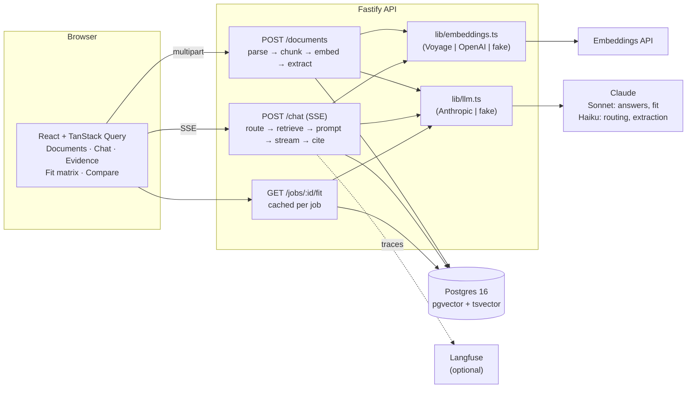

> **Reference draft.** Written by an AI assistant alongside the reference
> build, as a starting point. The owner's own reasoning lives in
> `docs/DECISIONS.md`, and the final README should be rewritten in their words.

# Career Intel

Upload one resume and several job descriptions, then ask how well you fit,
what you're missing, how the jobs compare and what to prepare for interviews.
Every answer is grounded in your documents, with numbered citations that open
the exact source passage.

## Quick start

```bash
docker compose up --build                     # web: http://localhost:8080  api: http://localhost:3001
docker compose --profile seed run --rm seed   # optional: load the fictional fixtures
```

That works from a clean clone with no keys. The app then runs in **demo
mode**: deterministic fake AI and embeddings, clearly badged in the UI. For
real answers:

```bash
cp .env.example .env    # set ANTHROPIC_API_KEY and VOYAGE_API_KEY (or OPENAI_API_KEY)
docker compose up --build
```

Local development:

```bash
cp .env.example .env    # DATABASE_URL points at the compose Postgres; keys optional
docker compose up db    # Postgres + pgvector
pnpm install
pnpm --filter @career-intel/api db:migrate
pnpm dev                # web :5173, api :3001 (with DATABASE_URL unset, the API uses an in-memory store)
pnpm seed               # load fixtures into the running API
```

| Command | What it runs |
| --- | --- |
| `pnpm test` | Unit and route tests (api, web, evals) plus the Postgres integration test (skipped without Docker) |
| `pnpm typecheck` | Strict TypeScript across the workspace |
| `pnpm eval` | Golden-set evals in fake mode (CI gate). `pnpm eval --real --judge` uses real models |
| `pnpm test:e2e` | Playwright: upload → ask → click a citation → highlighted evidence |

## Architecture



**Upload:** the file is type-checked (extension + magic bytes, 5MB), parsed
(unpdf / mammoth / UTF-8) and split into structural chunks (a job entry, a
requirements block), not fixed-size windows. Chunks are embedded in batches.
In parallel, Haiku extracts a typed profile (`JobProfile` with must/nice
requirements, or a resume skills-and-evidence profile), validated by Zod with
one repair retry. Everything is written in one transaction.

**Question:** Haiku classifies the intent (fit / gaps / compare /
interview_prep / general / off_topic). Job mentions ("Job #2", a title, a
company) become hard filters. Hybrid retrieval runs pgvector cosine and
Postgres full-text in parallel and merges them with reciprocal rank fusion.
The prompt builder wraps documents as escaped, untrusted data with short
chunk refs. Sonnet streams the answer over SSE, and the server keeps only
citations that point at chunks it actually supplied.

## RAG / LLM approach

| Area | Choice | Alternatives considered | Why |
| --- | --- | --- | --- |
| LLM | Claude Sonnet 5 for answers and fit analysis; Haiku 4.5 for routing, extraction, summaries and the eval judge (all env-configurable) | One model for everything | Routing and extraction are high-volume, schema-bound tasks where the cheaper, faster model is enough. The user-facing reasoning gets the stronger model. |
| Embeddings | Voyage `voyage-3-large` at 1024 dims (OpenAI `text-embedding-3-small` at 1024 as an alternative) | Local sentence-transformers | Strong retrieval quality, and no model hosting to run. A fixed 1024-dim column means switching providers only takes a re-ingest. |
| Vector store | Postgres + pgvector (HNSW, cosine) | Pinecone, Qdrant, Chroma | One database for documents, chunks, full-text, sessions and caches. It gives transactions and cascading deletes, and costs nothing extra to operate at this scale. |
| Orchestration | Plain TypeScript: small modules plus one `LLM` interface | LangChain / LlamaIndex | The pipeline is only a handful of steps. Owning it keeps prompts and control flow reviewable and testable, with no framework churn. |
| Chunking | Structure-aware (headings → sections → paragraphs) | Fixed 512-token windows | Resumes and JDs are short and sectioned. Structural chunks keep one role or one requirements block together, which makes both retrieval and citations better. |
| Retrieval | Hybrid (vector + full-text) with RRF, k=60 | Vector only; learned re-ranker | Full-text catches exact tokens ("Go", "SOC 2") that embeddings blur. RRF needs no score normalisation. A re-ranker isn't justified by the eval yet. |
| Context strategy | Per-intent table (`lib/strategy.ts`). Fit/gaps/compare get the full extracted profiles **plus** retrieved evidence | Top-k only | With a small corpus, completeness beats token savings: top-k alone can drop the one requirement a "what am I missing?" answer needs. Profiles are compact, and chunks carry the citations. |
| Prompt & history | Rules in the system prompt. Documents in `<document id label>` tags, escaped and marked untrusted. The last 6 messages (within a token budget) are kept verbatim, older turns are folded into a running summary by Haiku | Full history; vector memory | Bounded cost per turn without losing what was discussed. |
| Structured output | JSON-schema-constrained generation from the shared Zod schemas, then Zod validation, then one repair retry, then a clear 422 | Tool calls; regex parsing | One schema definition serves the API contract, the model constraint and validation. |
| Guardrails | Off-topic gets a fixed reply (no model call). Injection is handled by delimiting, escaping and system-only rules. Citations are validated server-side. Fit rows are mapped back by index. Rate limits, size limits, log hygiene | Moderation/injection classifier | Layered, cheap and testable. A classifier is the next step if abuse shows up. |
| Quality | 20-case golden set: intent accuracy, retrieval hit@k with forbidden-doc checks, must/mustNot mentions, citation groundedness, optional Haiku faithfulness judge. CI gates on fake mode | Manual spot checks | Regressions in routing, filtering and citation handling fail the build. Real-model runs measure answer quality. |
| Observability | pino JSON logs with request ids, plus per-request token, cost and latency totals. Langfuse traces (route / retrieve / summarize / generate spans + generations) when keys are set | OpenTelemetry end to end | Langfuse is built for LLM traces and cost. The `Tracer` interface keeps an OTel exporter a small change. |

## Key decisions and trade-offs

1. **Profiles + evidence for analytical questions.** More input tokens per
   question in exchange for complete answers about requirements. It's
   revisited when the corpus grows past about 20 documents.
2. **Fakes are first-class, not mocks.** The fake LLM and embedder are
   deterministic heuristics over structured inputs, so the whole app,
   tests, evals and e2e run offline and in CI for free. The trade-off is that
   fake-mode evals measure plumbing, not answer quality, and the report says
   so.
3. **Short citation refs, validated server-side.** Models reproduce `[C3]`
   more reliably than UUIDs, and the server drops any ref it didn't supply.
   The UI can therefore never link to evidence that wasn't in the context.
4. **Synchronous ingestion.** Uploads finish in seconds and the UI shows
   progress per file. A queue would add infrastructure without a user-visible
   benefit locally (see the AWS section for when it's worth adding).
5. **Fit matrix computed once per job and cached** until any document
   changes. It's the most expensive call, and its output only depends on the
   documents.

## Engineering standards

**Followed**
- Strict TypeScript (`noUncheckedIndexedAccess`, no `any`), with shared Zod
  contracts validated at the API boundary and in the client.
- Every I/O dependency is injected (`Store`, `LLM`, `Embedder`, `Tracer`),
  so there are no network calls in unit tests.
- Pure logic has unit tests (chunking, RRF with worked examples, mentions,
  history trimming, citations, prompt snapshot, SSE parser). Routes are
  tested with `app.inject()`. There's a real-Postgres integration test via
  testcontainers, one Playwright journey, and the golden-set evals.
- Structured logs with request ids, and tests proving document text and
  keys never reach logs.
- Conventional commits in small phases, CI running typecheck, tests, build,
  evals and e2e, and Docker Compose from a clean clone.

**Skipped, and why**
- Authentication and multi-tenancy: single-user local tool (see AWS plan).
- ESLint/Prettier config: strict `tsc` catches more of what matters here,
  and a formatter is a quick follow-up.
- Load testing and horizontal scaling: out of scope for a local assistant.
- Conversation history UI: the server persists messages for context, but
  there's no "reopen a past chat" screen.

## Privacy and data handling

- Documents, chunks, embeddings and conversations are stored only in your
  local Postgres (or in memory). Nothing is sent anywhere except the model
  and embedding providers you configure. `DELETE /documents/:id` (the bin
  icon in the UI) removes a document with its chunks and cached analysis,
  and `docker compose down -v` removes everything.
- Logs never contain document text or API keys. Error serialisation strips
  database query parameters, and a test enforces it.
- When Langfuse is enabled, traces contain the question, the answer, chunk
  ids, token counts and cost, but not document text.
- The fixtures in `evals/fixtures` are fictional. Don't commit real resumes
  to a public repo.

## Productionising on AWS

- **Compute:** API and web on **ECS Fargate** behind an ALB (App Runner for a
  smaller footprint). The web app could instead be static on S3 + CloudFront.
- **Data:** **RDS PostgreSQL** (pgvector is supported) with Multi-AZ,
  automated backups and PITR. Migrations run as a one-off ECS task in the
  deploy pipeline, not on container start.
- **Uploads:** a presigned PUT to **S3** (SSE-KMS, lifecycle rules for
  retention). S3 event → **SQS** → an ingestion worker (Fargate) that parses,
  embeds and extracts, with a DLQ and per-document status the UI polls. That
  takes slow provider calls off the request path and makes retries safe.
- **Secrets:** **Secrets Manager** for the Anthropic, embedding and Langfuse
  keys, injected as ECS secrets. IAM task roles, no static credentials.
- **Auth and tenancy:** **Cognito** (hosted UI + JWT) verified by the API,
  and a `user_id` on every table enforced in the store layer (or with
  Postgres row-level security).
- **Observability:** pino JSON → **CloudWatch Logs**, with metrics from log
  fields (latency, tokens, cost per request). **OpenTelemetry** traces to
  X-Ray alongside Langfuse for LLM traces. Alarms on error rate, p95
  latency and daily spend.
- **Cost controls:** per-user rate limits and daily token budgets, stored
  in Redis/ElastiCache so every instance shares them. Haiku for all
  high-volume steps, prompt caching on the stable system prompt and document
  block, the fit cache, capped `max_tokens`, and AWS Budgets alerts. Evals
  run on every PR in fake mode and nightly in real mode.
- **Security:** WAF on the ALB, private subnets for RDS, VPC endpoints for
  S3 and Secrets Manager, and a data retention policy with a "delete my
  data" job.

## How AI tools were used

This reference build was written by an AI coding assistant (Claude Code),
working from `CLAUDE.md`, in six phases. Each phase started with a written
plan in `docs/reference-notes.md` and ended with `pnpm typecheck && pnpm test`
green and a commit. Checks that caught the assistant's own mistakes:

- **A wrong hand calculation:** a worked RRF example in the test was off by
  one in the sixth decimal place (1/61 + 1/62). The code was right, and the
  test comment was fixed.
- **Streaming silently defeated:** the first version wrapped generation in a
  timing helper that buffered every token before yielding. It was caught in
  review of the diff and rewritten with explicit spans.
- **A log leak:** the error serializer kept stack traces, which repeat the
  error message, which for database errors includes query parameters (i.e.
  document text). A sentinel-string log test caught it.
- **Layout overflow:** a long citation snippet widened the chat column past
  the viewport. It was found by taking Playwright screenshots, not by the
  tests.
- **Routing blind spot:** "What benefits does Ledgerline offer?" was refused
  as off-topic. The eval flagged it, and the fix was a code-level rule: a
  question naming an uploaded job is never off-topic.

Guidelines followed: fakes before real providers, tests with every change,
no new dependencies without approval, and model IDs checked against current
provider documentation rather than recalled.

## Known limitations

- Fake mode is for demos and CI. Its answers are keyword heuristics.
- Injection defence is layered but not a guarantee. There's no classifier
  for injected document text.
- Fit judgements are an LLM's reading of the resume. "Met with no citable
  evidence" is downgraded to partial, but a wrong judgement is still
  possible.
- Evals use the in-memory store, so Postgres full-text ranking is covered by
  the integration test, not by the golden set.
- Scanned (image-only) PDFs aren't OCR'd, and the user is told so.
- Changing the embedding provider requires re-uploading documents. The
  model is recorded per document, but mixed embeddings aren't detected.

## What I'd do with more time

- A real-model eval run in CI on a schedule, with trend tracking in Langfuse
  datasets.
- Re-ranking (e.g. a cross-encoder) if hit@k drops on a larger golden set.
- Background ingestion with per-document status and retries.
- Conversation history UI, export of the fit matrix, and cover-letter
  drafting grounded in the same evidence.
- Auth, per-user data isolation and budgets (see the AWS plan).
