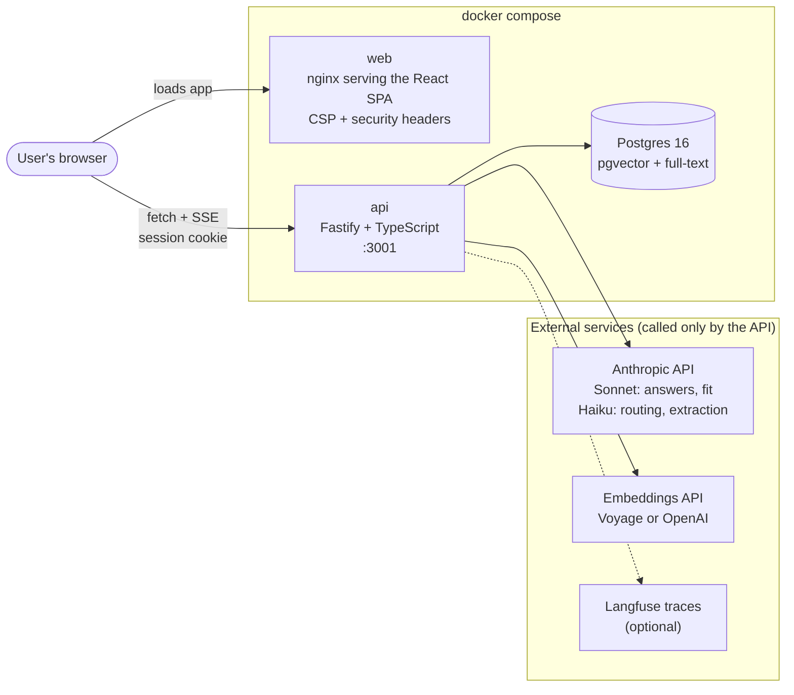
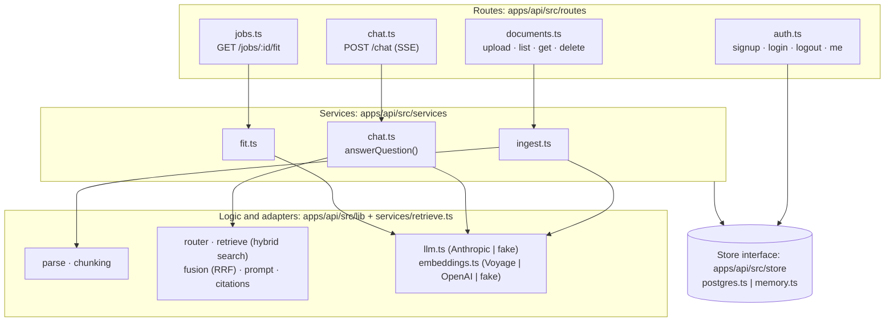
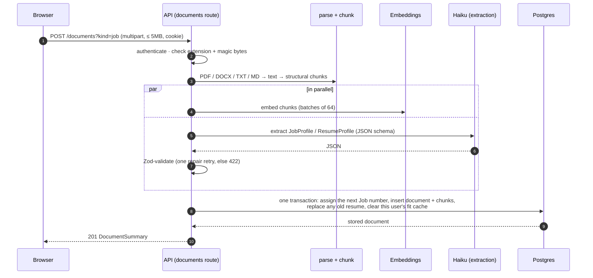
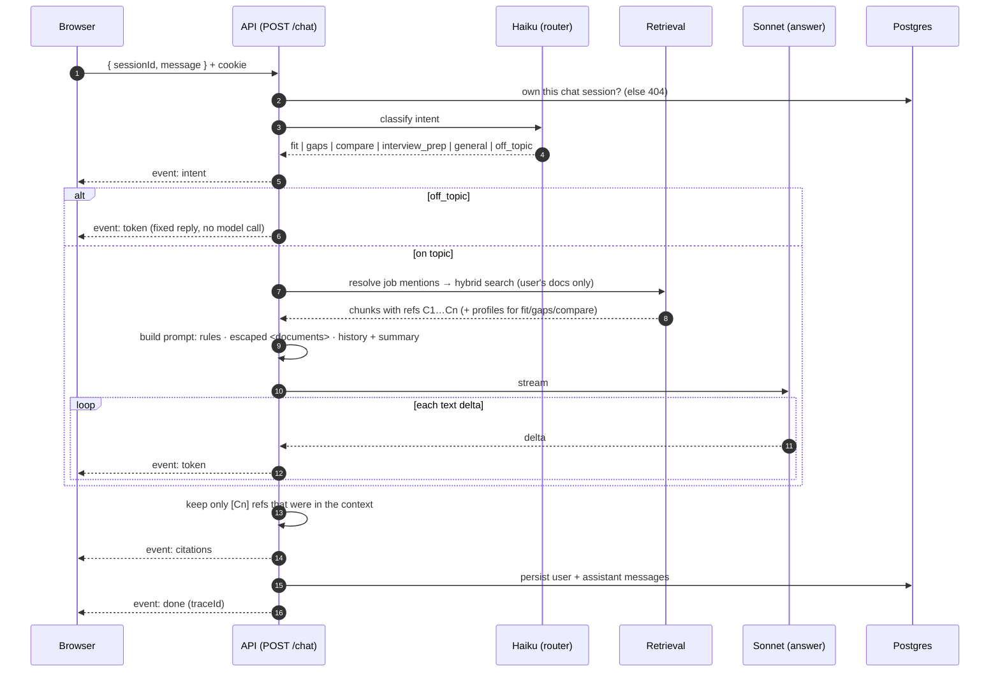
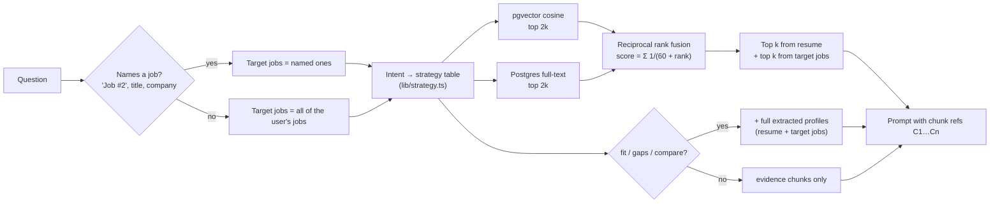
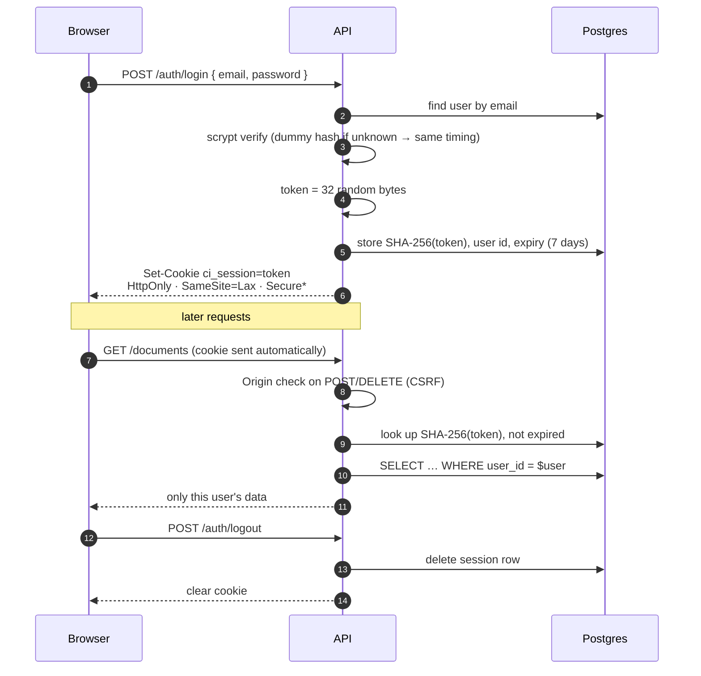
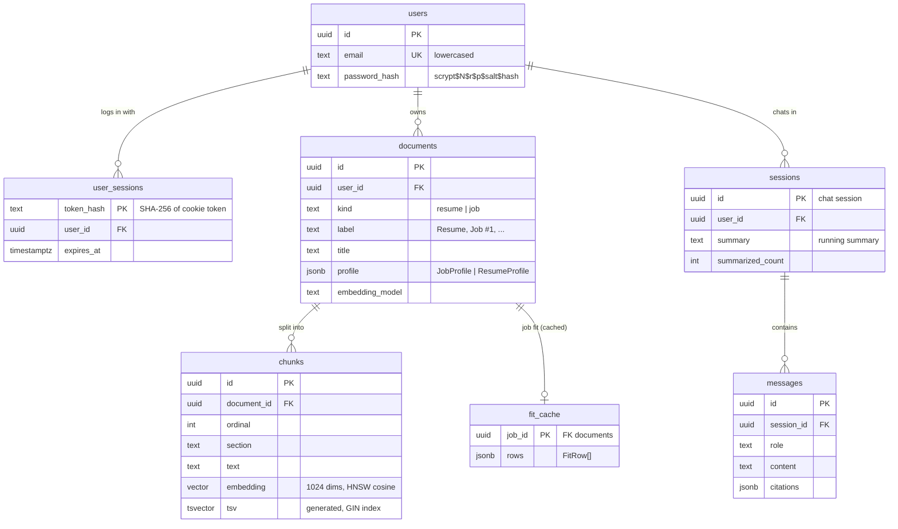
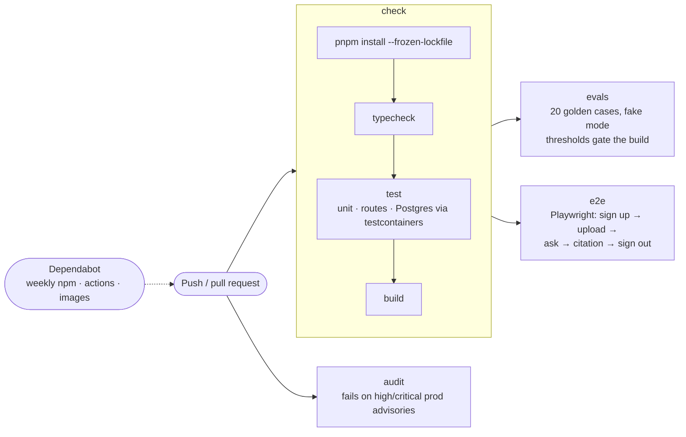
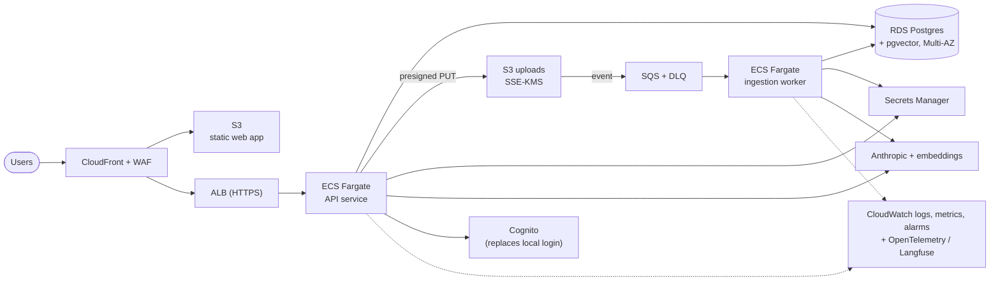

# Architecture

Diagrams of how Career Intel is built and how a request moves through it.
They are written in [Mermaid](https://mermaid.js.org/), which GitHub renders
inline. File paths are relative to the repo root.

1. [System overview](#1-system-overview)
2. [Inside the API](#2-inside-the-api)
3. [Uploading a document](#3-uploading-a-document)
4. [Answering a question](#4-answering-a-question)
5. [Retrieval and context strategy](#5-retrieval-and-context-strategy)
6. [Authentication](#6-authentication)
7. [Data model](#7-data-model)
8. [CI pipeline](#8-ci-pipeline)
9. [Production on AWS (proposed)](#9-production-on-aws-proposed)

---

## 1. System overview

The browser loads the static app from nginx and then talks to the API
directly. The API is the only component holding secrets (model keys,
database URL). With no keys configured, the API swaps in deterministic fakes
for Claude and embeddings, so the whole stack runs offline in "demo mode".

## 2. Inside the API

Everything with I/O (`Store`, `LLM`, `Embedder`, and `Tracer` for Langfuse
or no-op tracing) is an interface bundled into `Deps` and injected when the
app is built. Tests and evals swap
in the in-memory store and the fakes; the routes don't know the difference.

## 3. Uploading a document

Nothing is written until every step has succeeded, and the write is a single
transaction, so a failed upload never leaves a half-indexed document.

## 4. Answering a question

If the browser disconnects or the user presses Stop, the model stream is
aborted and the partial answer is saved with "…(stopped)".

## 5. Retrieval and context strategy

Vector search catches paraphrase ("container orchestration" ≈ "Kubernetes");
full-text catches exact tokens ("Go", "SOC 2"). Reciprocal rank fusion merges
the two by rank, so their incomparable scores never need normalising. For
analytical questions the complete profiles go in as well, so "what am I
missing?" can't skip a requirement that retrieval didn't surface.

## 6. Authentication

\* `Secure` is on when `COOKIE_SECURE=1` (anywhere served over HTTPS).
Another user's document or chat id is answered with 404, exactly like an id
that doesn't exist.

## 7. Data model

All foreign keys cascade on delete: removing a document removes its chunks
and cached fit, and removing a user removes everything they own.

## 8. CI pipeline

## 9. Production on AWS (proposed)

Not built: this is the target described in the README's productionising
section.

Moving uploads to S3 with an SQS-driven worker takes slow parsing,
embedding and extraction off the request path, and makes retries safe.
